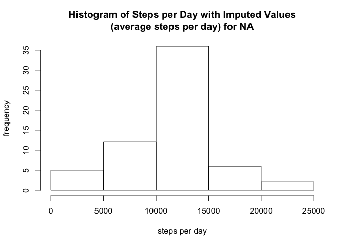

# Reproducible Research: Peer Assessment 1
davedev44 @ github  

Note: I drew upon several internet sources for completing this assignment,
for things such as customizing axis tick labels and positions, replacing
values, and lattice plotting options.

## Loading and preprocessing the data
We unzip the data and load it into a variable. No preprocessing.

```r
unzip("activity.zip")
stepsdata <- read.csv("activity.csv")
```

## What is mean total number of steps taken per day?

```r
# First we need to compute the total number of steps per day. 
# Sum over the steps variable for each date with ddply, which is in the plyr
# library
library(plyr)
dailystepsdata <- ddply(stepsdata, .(date), summarize, totSteps=sum(steps))

# First, we display a histogram of the steps per day.
hist(dailystepsdata$totSteps, 
     xlab="steps per day", 
     ylab="frequency", 
     main="Histogram of Steps per Day")
```

 

```r
# Next, simply compute the mean, without NA values
dailymeansteps <- mean(dailystepsdata$totSteps, na.rm=TRUE)
dailymeansteps
```

```
## [1] 10766.19
```

```r
# Similar for median
dailymediansteps <- median(dailystepsdata$totSteps, na.rm=TRUE)
dailymediansteps
```

```
## [1] 10765
```

We observe that the mean and median are close together (10766.19 and 10765,
respectively).

## What is the average daily activity pattern?

We can establish the average daily activity pattern by plotting mean
number of steps per 5-minute interval in the data.


```r
# Similar to prior example - first we summarize - we want the mean
# of the number of steps, but this time over interval rather than date
# once again, we ignore NA values
intavgstepsdata <- ddply(stepsdata, 
                         .(interval), 
                         summarize,
                         avgsteps=mean(steps, na.rm=TRUE))

# First, a time series plot to give an idea of which interval
# has the max average number of steps

# Since the intervals are specified as HHMM, I'd like to make
# sure the x-axis ticks go all the way to the end of the data,
# so I define a custom set of ticks. I define a custom format
# (forcing a 4 digit number with leading zeroes if necessary)
# to reflect a time rather than just an integer
intervalTicks <- c(0, 400, 800, 1200, 1600, 2000, 2400)

# For the plot, notable options: xact="n" to suppress x-axis for
# now, I'll draw it later; xlim set to the range of the ticks
# for the intervals
plot(intavgstepsdata, 
     type="l", 
     xlab="Interval Time (HHMM)", 
     ylab="Average number of steps", 
     main="Average Number of Steps per 5-minute interval, 0000-2355 daily",
     xaxt="n", 
     xlim=range(intervalTicks))

# Now draw the x-axis, with the format described above, at the points
# indicated by the ticks.
axis(side=1, at=intervalTicks, labels=sprintf("%04d", intervalTicks))
```

 

The plot shows the average daily activity pattern; the highest activity
interval is computed below, but from the plot it appears to be sometime
near 8:00 (early in the 8:00-12:00 span).


```r
# Finally, find the 5-minute interval with the maximum number of steps
# on average across the dataset

# We can use which.max to find the index of the row for the maximum,
# then get the interval from that row
maxRowIndex <- which.max(intavgstepsdata$avgsteps)
maxInterval <- intavgstepsdata[maxRowIndex,c("interval")]
maxInterval
```

```
## [1] 835
```

This result matches our suspicion - 8:35AM was interval with the highest
average number of steps.

## Imputing missing values

In this section we will impute the missing steps values. 


```r
# First: summary of the dataset will indicate where the NAs are
summary(stepsdata)
```

```
##      steps                date          interval     
##  Min.   :  0.00   2012-10-01:  288   Min.   :   0.0  
##  1st Qu.:  0.00   2012-10-02:  288   1st Qu.: 588.8  
##  Median :  0.00   2012-10-03:  288   Median :1177.5  
##  Mean   : 37.38   2012-10-04:  288   Mean   :1177.5  
##  3rd Qu.: 12.00   2012-10-05:  288   3rd Qu.:1766.2  
##  Max.   :806.00   2012-10-06:  288   Max.   :2355.0  
##  NA's   :2304     (Other)   :15840
```

```r
# First we count the number of cases with NA
# complete.cases will tell, for each row whether we have a complete case
# or not (e.g. whether the row contains NA or not); we then just
# sum the FALSE in that result with (!)
numNACases <- sum(!complete.cases(stepsdata))
numNACases
```

```
## [1] 2304
```

Thus we have 2304 cases with NAs in them, and the summary shows us that
they are all in the steps column, so we can focus our attention on that
column. We will impute those missing steps values by replacing the missing step
value with the average number of steps for that case's 5-minute interval.
This choice was based on a quick look at the data set; there appeared to be
days, such as 2012-10-01, with no steps data for any interval, thus a daily
mean would not work in that case.


```r
# Strategy for imputing the missing cases (steps values)
# Use the interval mean since there seems to be at least one
# day (2012-10-01) with no data across the entire day,
# thus the mean for the day would not work

# This is a bit contorted, I'm not sure it's the best way
# Basically: if the steps value is NA, match its interval
# in the dataframe containing the average number of steps
# per interval, and replace the NA with the average
# number of steps for that interval.

stepsdataimputeNA <- stepsdata

stepsdataimputeNA$steps <-
    ifelse(is.na(stepsdataimputeNA$steps), 
           intavgstepsdata$avgsteps[match(stepsdataimputeNA$interval, 
                                          intavgstepsdata$interval)], 
           stepsdataimputeNA$steps)

# Now, let's see what we ended up with - histogram, mean, median
# Code simply copied from previous runs

dailystepsdataimputeNA <- ddply(stepsdataimputeNA, 
                                .(date), 
                                summarize, 
                                totSteps=sum(steps))

# First, we display a histogram of the steps per day.
hist(dailystepsdataimputeNA$totSteps, 
     xlab="steps per day", 
     ylab="frequency", 
     main="Histogram of Steps per Day with Imputed Values\n(average steps per day) for NA")
```

 

```r
# Next, simply compute the mean
dailymeanstepsimputeNA <- mean(dailystepsdataimputeNA$totSteps)
dailymeanstepsimputeNA
```

```
## [1] 10766.19
```

```r
# Similar for median
dailymedianstepsimputeNA <- median(dailystepsdataimputeNA$totSteps)
dailymedianstepsimputeNA
```

```
## [1] 10766.19
```

We observe that the mean is the same as without imputing NA (10766.19), but the 
median changed - it is now equal to the mean. This
makes sense - the imputed values were the mean per daily interval, so it
is hardly surprising that the mean wouldn't change -- and that the values
are now centered (e.g. median) around the mean more closely (exactly).

In addition, as we would expect, imputing missing values as we did would
increase the numbers of daily total steps - in this case, the increase
was most pronounced in the middle column (was around 25 without imputing, over
35 with imputing) -- and this makes sense based on the method employed --
since we used interval average steps to replace missing values, we would
expect movement of values / coalesence in the middle range of the data.

## Are there differences in activity patterns between weekdays and weekends?

```r
# First we compute a factor indicating whether the date was a weekend or a
# weekday. We need to coerce the date column, currently a factor, to a date,
# use the weekday function to compute the day name for each date, then 
# convert the day name to our intended factor ("weekday" for M-F, "weekend"
# for Saturday and Sunday)

stepsdataimputeNA$weekday <- weekdays(as.Date(stepsdataimputeNA$date))

stepsdataimputeNA$weekday <- as.factor(ifelse(stepsdataimputeNA$weekday %in% c("Saturday", "Sunday"), "weekend", "weekday"))

# Since we want to compare average number of steps for all intervals,
# between weekday and weekend, we need to compute those averages
# Same as prior computation, except this time, we compute the average
# for each interval for weekday and for weekend.
intavgstepsdataimputeNA <- ddply(stepsdataimputeNA,
                                .(interval, weekday), 
                                 summarize,
                                avgsteps=mean(steps))

# Now we plot conditional on weekday versus weekend,
# in order to compare - use a lattice panel plot

# Notable options: scales is the analog of the commands
# above to control the x axis tick locations and labels
# There was probably a better way to construct those lists
library(lattice)

xyplot(avgsteps ~ interval | weekday, 
       intavgstepsdataimputeNA, type="l", 
       layout=c(1,2), 
       xlab="Interval Time (HHMM)", 
       ylab="Average number of steps", 
       main="Average Number of Steps per 5-minute interval, 0000-2355 daily",     
       scales=list(x=list(at=c(0, 400, 800, 1200,1600,2000,2400), 
          labels=c("0000", "0400", "0800", "1200", "1600", "2000", "2400"))))
```

 

We observe the following weekday/weekend differences: while early morning
is quite popular in both cases (around 0800), there is more weekend activity
across the entire day (versus on weekdays when many people are probably
working during the day), and this probably drives the somewhat higher level 
for weekday evenings versus weekend evenings.
